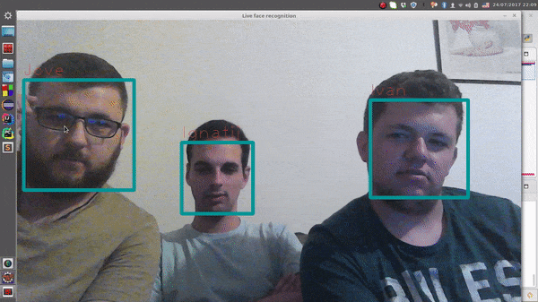

# Real time webcam face recognition system



***

Simple face recognition system based on OpenCV 3.2.0 and Python 3.5.2.

 - face detection using Cascade Classifier
 - recognition with LBPH (Local Binary Patterns Histogram)

There are exactly 10 images per person, and they are stored in src/persons/{person_name} folder.
<br/>
To add new person:
 - open app.py and uncomment the following line
```python
op.take_images(webcam, detector);
```
 - execute app.py
 - enter {person_name}
 - the application will take 10 images and store them into src/persons/{person_name} folder 

To start recognizing:
 - open app.py and make sure the following line is not commented:
```python
op.train_and_run(webcam, detector)
```
 - execute app.py (Press ESC to exit)

***
